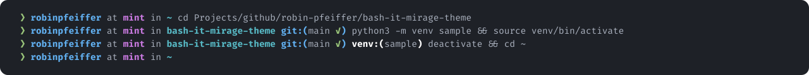

# Bash-it Mirage Theme



## Features

- Non-null exitcode visualization
- Show presence of sudo timestamp file
- Show current active virtual environment
- SCM/Git support

## Installation

This assumes that you have Bash-it already installed and set up. If you have not done so, then follow the instructions on [their page](https://github.com/Bash-it/bash-it#installation).

```sh
git clone git@github.com:robin-pfeiffer/bash-it-mirage-theme.git
cd bash-it-mirage-theme
./install.sh
bash-it restart
```

### Settings

Export variables from the Mirage theme to your `.bashrc` or `.bash_profile` file(s). Below are the variables that can be altered.

```sh
export THEME_SHOW_SUDO=true
export THEME_SHOW_EXITCODE=true
export THEME_SHOW_SCM=true
export THEME_SHOW_VENV=true
```

## Development

```sh
  # Fedora/CentOS
sudo dnf install ShellCheck
  # Ubuntu/Debian
sudo apt install shellcheck 
  # macOS
brew install shellcheck
```

After making changes to `mirage.theme.bash` run `shellcheck mirage.theme.bash` and fix any errors or warnings before committing.
